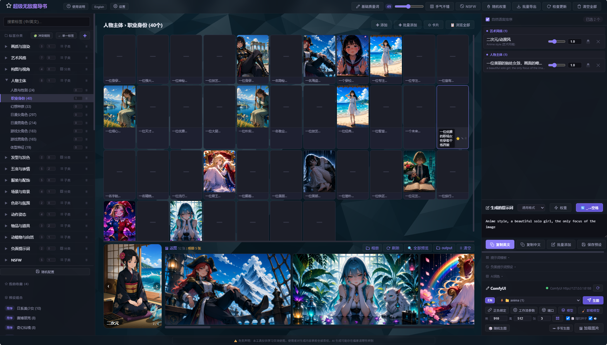

# 🪄 超级无敌魔导书 — AI绘画提示词组合器

> 🪄 让 AI 绘画提示词像魔法一样简单 — 桌面/手机双端，选标签即出图，一键发送 ComfyUI

面向 Stable Diffusion / ComfyUI 的标签浏览、随机组合、AI润色、批量生图全功能 Web 工具。桌面/手机双端适配，数据通过 Flask 服务端同步。

## 📸 界面预览

---

## 项目功能总览

### 标签管理
- 两套独立标签库自由切换：短语标签（2553条自然语言短句）+ 单一标签（2547条 Danbooru 风格单词）
- 三级分类浏览：大类 → 子类 → 标签网格，左侧分类树展开/折叠记忆
- 中英文搜索、⭐ 收藏夹、自定义标签增删改、分类/子类增删
- NSFW 标签分类及开关控制

### 提示词组合
- 正面/负面双面板，分组显示、拖拽排序、🔒 锁定标签（随机不替换）
- 独立权重滑块（0.5~2.0），⚡ 全局权重开关，🔄 空格转换
- 📐 提示词模板（`{tags}` 占位符），模板保存/加载多套管理
- 📝 批量添加（中英文混合匹配）、多种导出格式（通用 / NovelAI / SD WebUI）
- 🚫 负面提示词预设：6 套内置预设，生图时自动注入，支持保存加载

### 随机生成
- 🎲 手气不错：分类/子类每级独立上限、📁/📂 随机模式切换
- 💾 随机配置方案：一键保存/加载全套随机设置
- 🔞 NSFW 开关、⚖ 随机权重、智能防冲突体系（`single`/`singlePool`/`poolGroup`）
- 🎲 随机生图：每次重抽标签→排队生成，张张不同
- 📄 批量导出 N 组随机提示词

### AI 润色
- 支持 OpenAI / LM Studio / Ollama / 自定义 API，配置服务端存储桌面手机共享
- 🎬 电影级提示词导演预设（中英文双版），输出含材质/光线/色彩/镜头参数
- 🏷 标签发送时自动带分类名 `[人物主体] [发型与发色]`，大模型理解更准确
- 自定义系统指令，💾 保存/📂 加载润色预设（内置 5 套默认预设）
- 🤖 手动润色 + 🎨 生图前自动润色，中/英文发送
- 📜 润色记录：保存最近 100 条，翻页浏览，独立复制/发送
- 负面标签和负面预设不经过大模型，直接拼回

### ComfyUI 集成
- 工作流管理：API 格式 JSON 放入 `workflows/` 文件夹即可识别
- 🔗 CLIP 正负节点绑定（保存后换工作流互不干扰）
- ⚙ 工作流参数设置（采样器/步数/CFG/Denoise）
- 🎭 模型选择（Checkpoint / UNET / CLIP / VAE / LoRA + 权重）
- 🌐 端口配置 + 连接测试
- 🚀 普通生图 / 🎲 随机生图 / ✏ 手写生图 / 📜 润色记录生图
- 🖼 加载图片：上传绑定 LoadImage 节点，支持拖拽
- 🔄 **反推生图**：图片→视觉大模型反推提示词→自动发送 ComfyUI 生图
- 📂 反推预设系统：内置 6 套专业预设（通用/转动漫/转真人/转油画/转赛博/中文反推），支持保存/加载/删除
- 队列系统：排队生成、逐一出图、终止、清空
- 返图预览：缩略图横向滚动 → 点击放大 → 缩放/拖拽/下载/键盘导航
- 图片代理：手机端通过 Flask 访问 ComfyUI 图片

### 数据同步
- 收藏、随机限制、模板、润色记录、工作流参数、CLIP 绑定、负面预设、模型选择等全部服务端存储
- 桌面和手机自动双向同步，刷新不丢失
- LLM 配置和润色预设独立存储到 `user_data/`，多设备共享

### 手机端专属
- 底部三 Tab 导航：标签 / 提示词 / 生图
- 左侧滑出抽屉：分类树 + 步进器 + 随机模式 + 收藏/预设
- 标签网格下方已选标签栏（🔒 锁定金色高亮）
- 全屏按钮、NSFW 开关、免责声明弹窗
- ComfyUI 返图画廊直接在生图 Tab 显示
- 预览图手指缩放拖拽

---

## 首次使用指南

### 运行环境
- Windows 系统，安装 Python 3
- Chrome / Edge 浏览器（桌面端），手机浏览器（手机端）
- 可选：ComfyUI（生图）、LM Studio / Ollama（AI 润色）

### 启动步骤
1. 双击 `start.bat` 或命令行运行 `python launch.py`
2. 浏览器自动打开 `http://127.0.0.1:5801`
3. 如需 ComfyUI 生图：
   - 先启动 ComfyUI（默认 `http://127.0.0.1:8188`）
   - 在 ComfyUI 中搭好工作流 → **Workflow → Export (API)** → 保存为 JSON
   - 将 JSON 文件放入项目的 `workflows/` 文件夹
   - 回到页面，刷新，下拉选择工作流
4. 如需 AI 润色：启动 LM Studio / Ollama → 页面 AI 润色区配置地址和模型

### ComfyUI 首次使用流程
1. 页面下拉选择工作流 → 自动读取宽高
2. 点击 🔗 **正负绑定** → 指定正面/负面提示词分别发到哪个 CLIP 节点 → 💾 保存
3. 点击 ⚙ **工作流参数** → 调整采样器/步数/CFG → 保存
4. 点击 🎭 **模型** → 选择 Checkpoint / LoRA 等
5. 选标签 → 点 🚀 **生图**
6. 🔄 反推生图：点 🖼 加载图片 → 选图 → 输入反推指令 → 自动分析出图

### 手机端使用
- 手机和电脑连接同一 WiFi
- 手机浏览器访问 `http://<电脑IP>:5801`（电脑 IP 见启动窗口日志）
- 数据自动双向同步，收藏/预设/润色记录/配置全部共享
- 底部 Tab 切换：📁 标签 / 📝 提示词 / 🎨 生图

---

> 📖 开发者文档见 [DEV.md](DEV.md)
